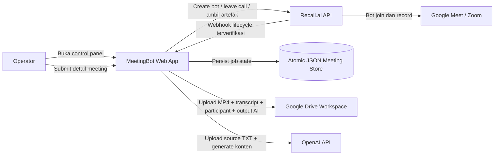
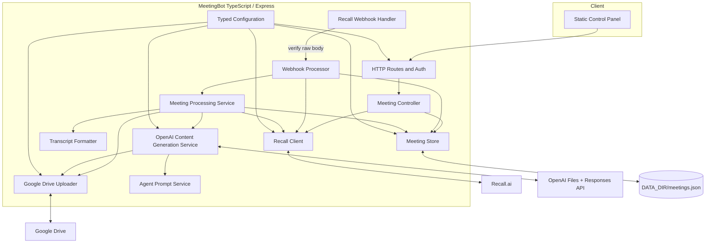
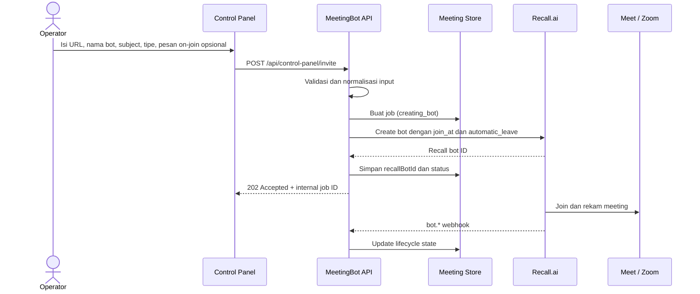
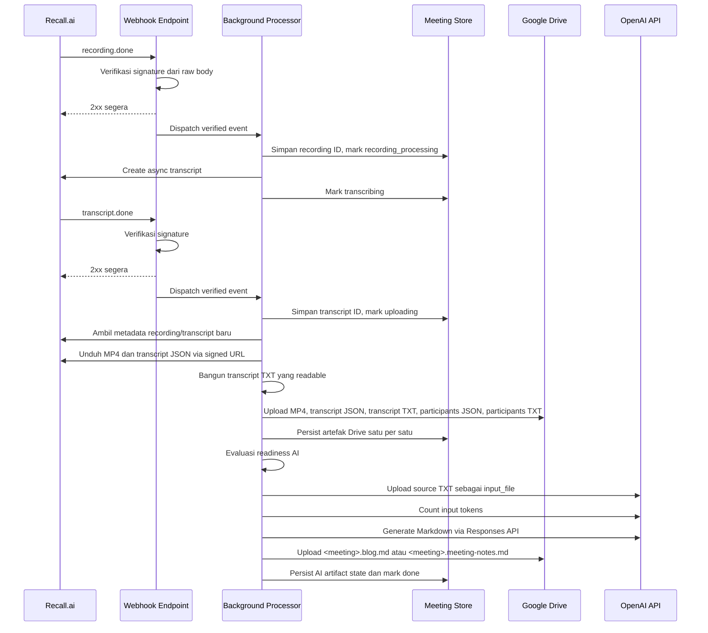
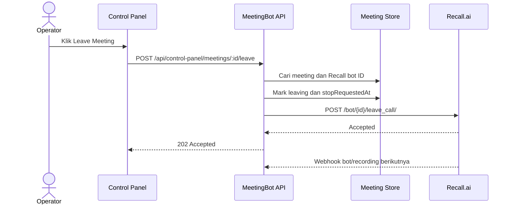
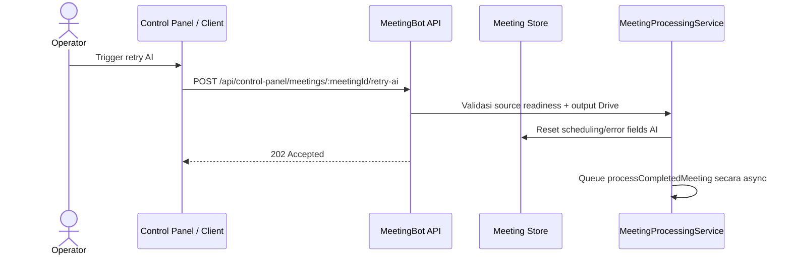
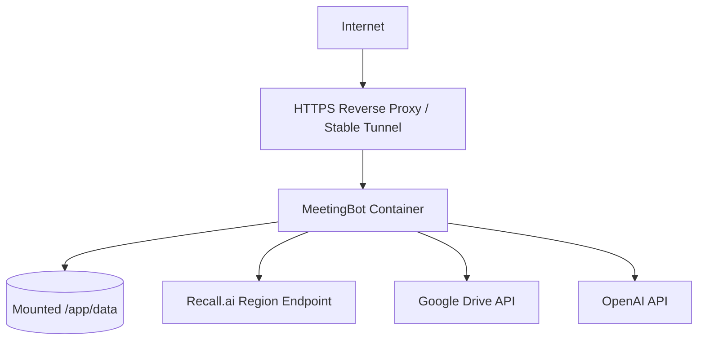

# MeetingBot Recall.ai Architecture

> Target architecture untuk rebuild MeetingBot. Recall.ai menggantikan engine meeting lokal berbasis Playwright/Puppeteer/FFmpeg, sementara aplikasi web TypeScript/Express, workflow Google Drive, dan pipeline OpenAI tetap berjalan di satu backend.

## 1. Tujuan arsitektur

Aplikasi hasil rebuild harus:

- memungkinkan operator mengirim URL meeting, nama bot, subject meeting, tipe meeting, dan pesan on-join opsional per meeting;
- memakai Recall.ai untuk join dan merekam Google Meet atau Zoom;
- melacak seluruh lifecycle bot melalui webhook terverifikasi;
- mendukung automatic leave dan manual leave dari control panel;
- membuat transcript pasca-meeting dengan Recall.ai;
- mengunggah mixed MP4 recording, dua format transcript, dan dua artefak participant ke Google Drive;
- merutekan file berdasarkan `RAPAT` atau `SEMINAR`;
- menjaga state job tetap persisten saat proses atau container restart;
- tetap idempotent saat Recall mengirim ulang webhook;
- menghindari polling ke Recall.ai;
- menghasilkan blog seminar atau notulen rapat melalui OpenAI setelah source file siap.

## 2. Non-goal

Aplikasi ini **tidak**:

- mengotomasi browser Chrome lokal;
- menjalankan Xvfb, PulseAudio, Fluxbox, atau FFmpeg;
- memberi live caption atau transkripsi real-time;
- menambahkan relational database atau distributed message broker;
- menyimpan signed media URL Recall secara permanen;
- memotong transcript besar diam-diam dengan hierarchical chunking.

## 3. Konteks sistem



## 4. Desain komponen tingkat tinggi



### Komponen utama

| Komponen | Tanggung jawab |
|---|---|
| `config.ts` | Validasi environment variable, expose typed configuration, dan hanya mencetak info startup yang aman. |
| `MeetingController.ts` | Validasi input user, membuat job persisten, memanggil Recall, dan mengembalikan response API. |
| `RecallClient.ts` | Menangani seluruh REST call Recall dan retry untuk `429`, `503`, dan `507`. |
| `RecallWebhookService.ts` | Menerima raw webhook body, memverifikasi signature, menolak request tidak terpercaya, dan mengakui request valid secepat mungkin. |
| `MeetingStore.ts` | Menyimpan meeting job secara atomik dengan temp-file plus rename dan write queue tunggal. |
| `MeetingProcessingService.ts` | Mengambil signed URL baru, mengunduh artefak, upload ke Drive, menjalankan recovery, dan memutuskan kapan AI generation siap dijalankan. |
| `AgentPromptService.ts` | Memuat prompt dari `docs/agent`, cache source prompt, dan me-render `{{CURRENT_DATE}}`. |
| `OpenAIContentGenerationService.ts` | Menyiapkan source file, upload file sementara OpenAI, hitung token, generate Markdown, upload output ke Drive, dan cleanup file sementara. |
| `GDriveUploader.ts` | Mengunggah exact filename dengan MIME type yang benar ke folder Drive yang dikonfigurasi. |
| Control panel | Membuat bot, menampilkan status live, melihat Meeting History Google Drive, dan meminta manual leave. |

## 5. Workflow utama

### 5.1 Membuat dan menjalankan bot



### 5.2 Selesai meeting, transcript, upload, dan AI generation



### 5.3 Manual leave



### 5.4 Manual retry AI



## 6. Model state job

Status utama:

```text
creating_bot
  -> joining
  -> waiting_room
  -> in_call_not_recording
  -> recording
  -> leaving
  -> call_ended
  -> recording_processing
  -> transcribing
  -> uploading
  -> completed
```

Cabang failure:

```text
any active state -> failed
uploading -> completed_with_errors
```

Recall status code dan subcode harus tetap open string, bukan closed enum.

### AI artifact state

AI state yang persisten melacak:

```text
kind
status
generationDateIso
driveFileId
outputFilename
openaiResponseId
openaiRequestId
openaiInputFileIds
inputTokens
outputTokens
attemptCount
lastAttemptAt
nextRetryAt
completedAt
errorCode
errorMessage
```

Payload control panel yang aman hanya mengekspos field operator-safe seperti status, attempt count, timestamp, filename, dan sanitized error.

## 7. Routing output Google Drive

| Meeting type | Parent folder | Subfolder per meeting | Artefak yang diunggah |
|---|---|---|---|
| RAPAT | GDRIVE_FOLDER_RAPAT | <sanitized-meeting-subject>_<YYYY-MM-DD> | MP4, transcript JSON, transcript TXT, participants JSON, participants TXT, meeting notes Markdown |
| SEMINAR | GDRIVE_FOLDER_SEMINAR | <sanitized-meeting-subject>_<YYYY-MM-DD> | MP4, transcript JSON, transcript TXT, blog Markdown |

Semua artefak untuk satu meeting masuk ke subfolder meeting yang sama. Tidak ada nested folder tambahan untuk output AI.

### Nama file deterministik

```text
YYYY-MM-DD_HH-mm_<sanitized-meeting-subject>_<short-job-id>.mp4
YYYY-MM-DD_HH-mm_<sanitized-meeting-subject>_<short-job-id>.transcript.json
YYYY-MM-DD_HH-mm_<sanitized-meeting-subject>_<short-job-id>.transcript.txt
YYYY-MM-DD_HH-mm_<sanitized-meeting-subject>_<short-job-id>.participants.json
YYYY-MM-DD_HH-mm_<sanitized-meeting-subject>_<short-job-id>.participants.txt
YYYY-MM-DD_HH-mm_<sanitized-meeting-subject>_<short-job-id>.blog.md
YYYY-MM-DD_HH-mm_<sanitized-meeting-subject>_<short-job-id>.meeting-notes.md
```

## 8. Trust boundary dan source file

```text
Prompt di docs/agent = trusted deployment-controlled instructions
Transcript TXT / participants TXT = untrusted source material
Markdown hasil model = output yang disimpan durably di Drive
```

Aturan penting:

- transcript JSON dan participant JSON tidak pernah dikirim ke OpenAI;
- transcript TXT wajib untuk seminar;
- transcript TXT + participants TXT wajib untuk rapat;
- source file disuplai sebagai OpenAI `input_file`, bukan inline instruction text;
- prompt loader selalu menambahkan instruction keamanan tetap agar model memperlakukan transcript dan participant sebagai data tak terpercaya.

## 9. Lifecycle file OpenAI

```text
Source TXT tersedia
  -> materialize local working copy
  -> normalisasi dan validasi ukuran
  -> upload OpenAI Files API user_data
  -> persist temporary file IDs
  -> count input tokens
  -> call Responses API
  -> upload Markdown ke folder meeting di Drive
  -> delete temporary OpenAI files
```

Aturan:

- total gabungan input file dibatasi 48 MiB;
- `truncation` dinonaktifkan;
- `tools` kosong;
- `store: false`;
- output kosong atau truncated dianggap gagal;
- job yang terlalu besar gagal secara eksplisit, tidak dipotong diam-diam.

## 10. Batas kepercayaan webhook

Endpoint webhook Recall adalah security boundary.

```mermaid
flowchart LR
    R[Recall.ai] -->|Headers + raw payload| E[/api/recall/webhook]
    E --> V{Signature valid?}
    V -->|No| X[Reject 4xx dan jangan proses]
    V -->|Yes| Q[Dispatch event]
    Q --> A[Return 2xx segera]
    Q --> P[Async processing]
```

Perilaku wajib:

- mempertahankan raw body persis untuk verifikasi signature;
- memilih secret yang benar sesuai jenis webhook;
- menolak header verifikasi yang hilang atau tidak valid;
- tidak pernah memproses payload yang tidak terverifikasi;
- mengakui webhook valid sebelum pekerjaan panjang dimulai;
- menganggap duplicate delivery sebagai hal normal dan memproses secara idempotent;
- tidak pernah mengekspos API key atau webhook secret ke log atau JSON control panel.

## 11. Retry, idempotency, dan recovery

### Retry Recall REST

| Status | Perilaku |
|---|---|
| `429` | Hormati `Retry-After`, tambah jitter, lalu retry. |
| `503` | Tunggu, tambah jitter, lalu retry. |
| `507` | Bot pool unavailable; tunggu lebih lama, tambah jitter, lalu retry. |
| Non-2xx lain | Kembalikan typed error dengan diagnostik yang aman. |

### Retry AI tingkat aplikasi

- maksimum 5 percobaan job;
- delay: 1 menit, 5 menit, 15 menit, 1 jam, 6 jam;
- hanya error retryable yang menjadwalkan `nextRetryAt`;
- error non-retryable tetap failed sampai ada perubahan input atau konfigurasi.

### Idempotency

- pakai Recall ID yang persisten untuk memetakan semua event ke satu internal job;
- pembuatan transcript harus dijaga oleh `transcriptRequestedAt` atau guard setara;
- processing artefak memakai lock per meeting;
- sebelum upload, cek apakah Drive artifact ID atau exact filename sudah ada;
- setiap upload sukses dipersist segera;
- duplicate webhook harus menjadi no-op setelah aksi terkait selesai.

### Recovery saat restart

Saat startup aplikasi:

1. memuat `meetings.json`;
2. menjalankan ulang job yang terputus saat `recording_processing`, `transcribing`, atau `uploading` jika Recall ID cukup;
3. tidak otomatis membuat bot Recall baru;
4. mengambil ulang metadata media baru, bukan memakai signed URL yang lama;
5. melanjutkan hanya upload yang belum selesai;
6. mengecek AI state `processing` yang stale setelah 30 menit;
7. mencoba menghapus temporary OpenAI file IDs yang masih tersimpan;
8. mengecek apakah output Markdown yang diharapkan sebenarnya sudah ada di Drive sebelum generate ulang.

## 12. Persistensi data

Deployment awal menggunakan:

```text
DATA_DIR/meetings.json
```

Persyaratan:

- membuat directory dan file jika belum ada;
- menulis ke temporary file lalu rename secara atomik;
- men-serialize write lewat satu queue/mutex;
- tidak pernah menghapus active job secara diam-diam;
- menyimpan minimal 200 history record terbaru;
- mount `./data:/app/data` di Docker.

## 13. Deployment



Karakteristik container:

- base image Node 20 slim yang ter-maintain;
- pnpm via Corepack;
- runtime user non-root;
- tidak ada Chrome, Playwright, Puppeteer, X11, FFmpeg, PulseAudio, atau Fluxbox;
- health endpoint di `/health`;
- volume persisten `./data:/app/data`;
- URL HTTPS publik yang stabil untuk webhook Recall;
- prompt `docs/agent` ikut dibawa ke image runtime.

## 14. Failure handling matrix

| Kegagalan | Perilaku yang diharapkan |
|---|---|
| Recall bot creation gagal | Persist `failed`, tampilkan error aman di control panel. |
| Bot rejected atau fatal | Persist Recall code/subcode dan tandai `failed`. |
| Waiting-room timeout | Biarkan Recall mengakhiri bot; state mengikuti webhook. |
| Recording gagal | Tandai `failed`; jangan minta transcript. |
| Request transcript gagal sementara | Retry lewat `RecallClient`. |
| Transcript gagal permanen | Lanjut video-only upload dan mark `completed_with_errors`. |
| Download MP4 gagal | Persist error dan biarkan retry lewat startup/event berikutnya. |
| Salah satu upload Drive gagal | Pertahankan artefak yang sukses; retry hanya artefak yang kurang. |
| Duplicate webhook | Return `2xx`; processing idempotent tidak membuat duplikasi. |
| Signature webhook tidak valid | Return `4xx`; jangan simpan atau proses payload. |
| Aplikasi restart saat upload | Muat ulang job dan lanjutkan hanya pekerjaan yang belum selesai. |
| OpenAI rate limit / timeout / server error | Jadwalkan retry job-level sesuai backoff. |
| OpenAI auth / permission / prompt / input oversize | Tandai failed tanpa auto-retry. |

## 15. Evolusi ke depan

Saat beban tumbuh melebihi satu container, evolusikan arsitektur dalam urutan ini:

1. ganti JSON store dengan PostgreSQL;
2. tambahkan durable queue seperti Redis/BullMQ, SQS, atau RabbitMQ;
3. pisahkan webhook acknowledgment dan worker artefak ke proses terpisah;
4. simpan webhook event ID untuk deduplication dan audit yang eksplisit;
5. tambahkan object storage sebagai staging area untuk media besar;
6. tambahkan user account, authorization, dan routing Drive per tenant;
7. tambahkan scheduling dan calendar integration sambil tetap mempertahankan abstraksi `join_at`.
