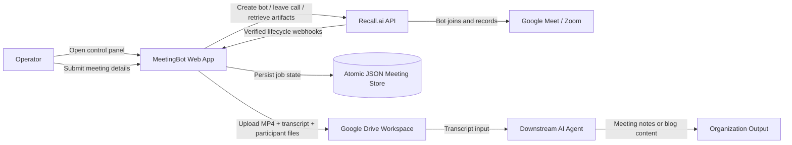
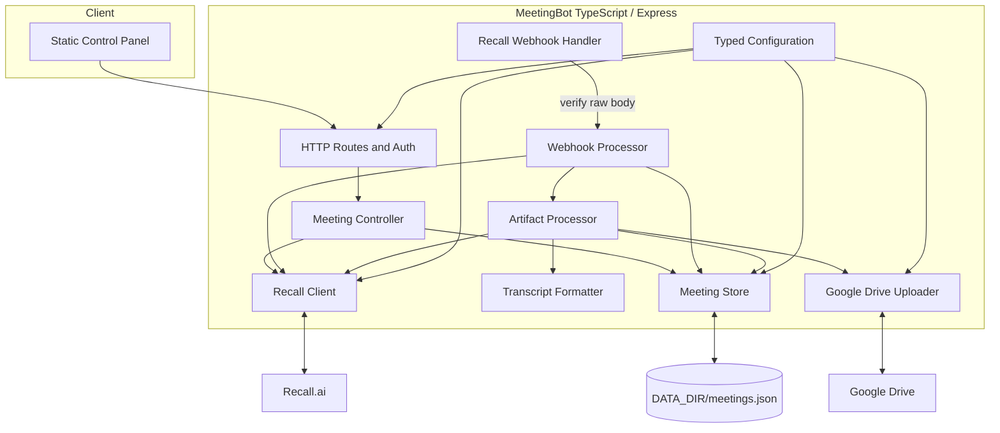
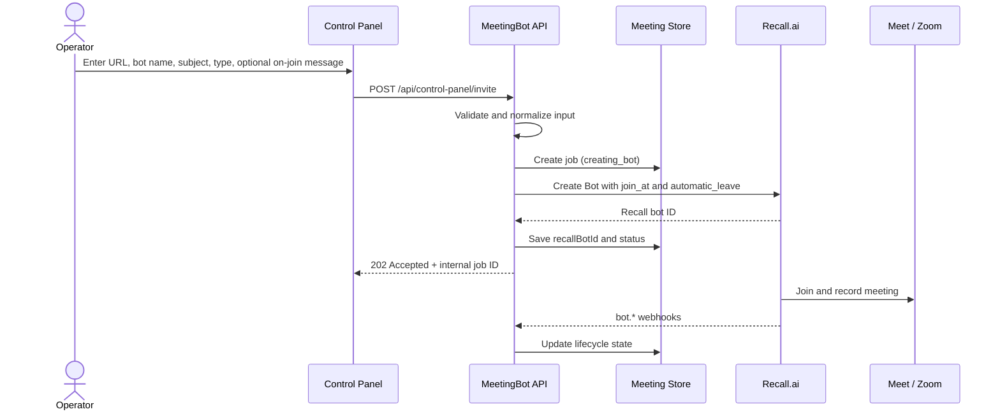
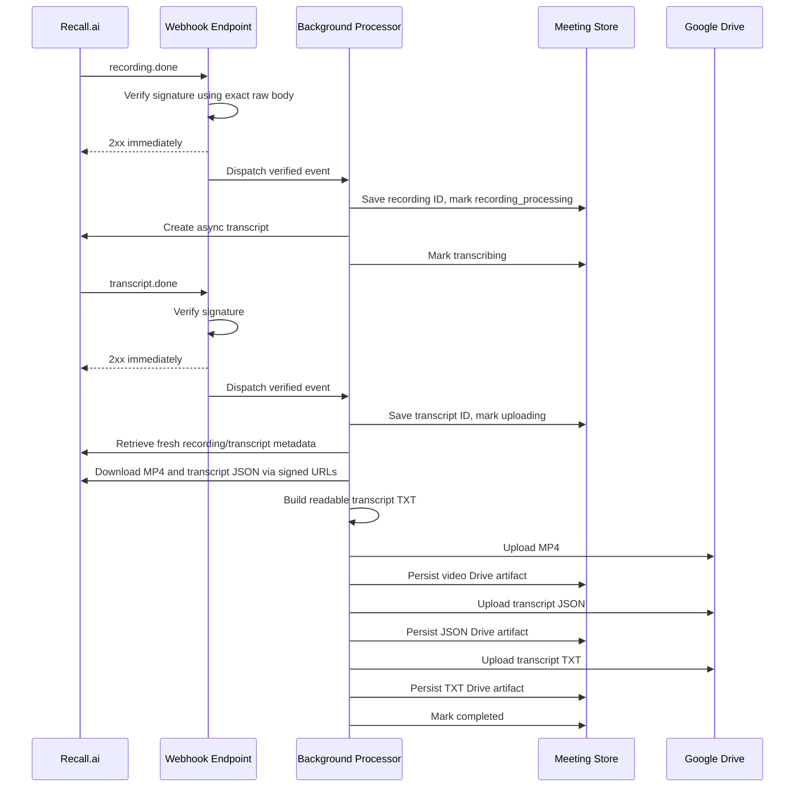
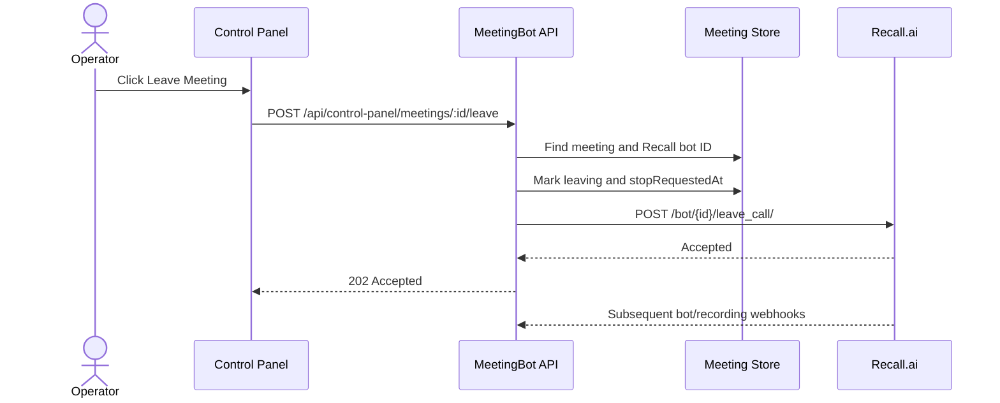
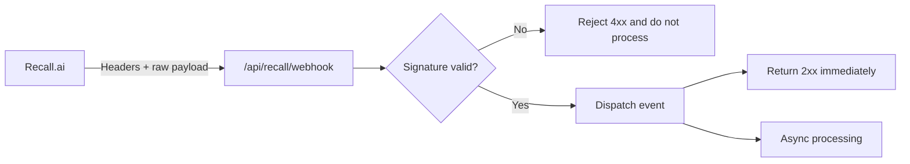
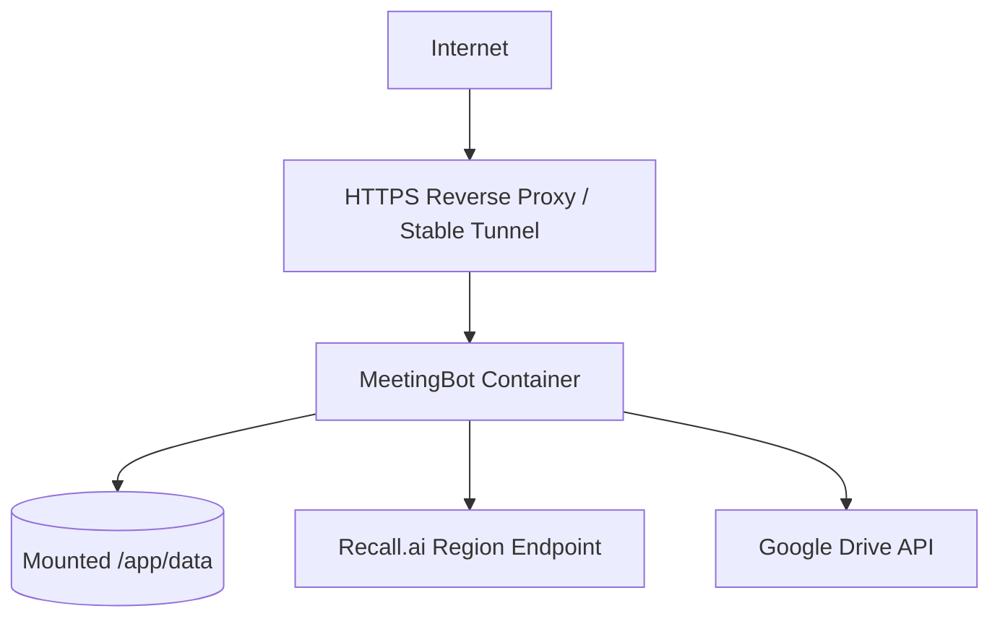

# MeetingBot Recall.ai Architecture

> Target architecture for the MeetingBot rebuild. Recall.ai replaces the local Playwright/Puppeteer/FFmpeg meeting engine while the existing TypeScript/Express web application and Google Drive workflow remain.

## 1. Architecture goals

The rebuilt application must:

- let an operator submit a meeting URL, bot name, meeting subject, meeting type, and an optional per-meeting on-join message;
- use Recall.ai to join and record Google Meet or Zoom meetings;
- track the complete bot lifecycle through verified webhooks;
- support automatic leaving and manual leave from the control panel;
- create a post-meeting transcript with Recall.ai;
- upload the mixed MP4 recording, two transcript formats, and two participant artifacts to Google Drive;
- route files according to `RAPAT` or `SEMINAR`;
- preserve job state across process or container restarts;
- remain idempotent when Recall retries webhook delivery;
- avoid polling Recall.ai.

## 2. Non-goals for this rebuild

This application does **not**:

- automate a local Chrome browser;
- run Xvfb, PulseAudio, Fluxbox, or FFmpeg;
- generate meeting notes or blog articles itself;
- provide real-time transcription or live captions;
- add a relational database or distributed message broker;
- store Recall signed media URLs permanently.

A separate downstream AI agent consumes transcript files from Google Drive and generates either meeting notes or website/blog content.

## 3. System context



## 4. High-level component design



### Main components

| Component | Responsibility |
|---|---|
| `config.ts` | Validate environment variables, expose typed configuration, print only safe startup information. |
| `MeetingController.ts` | Validate user input, create persistent jobs, call Recall, and return API responses. |
| `RecallClient.ts` | Own every Recall REST call and retry behavior for `429`, `503`, and `507`. |
| `RecallWebhookHandler.ts` | Receive raw webhook bodies, verify signatures, reject untrusted requests, and acknowledge valid requests quickly. |
| `WebhookProcessor.ts` | Process verified bot, recording, and transcript events asynchronously and idempotently. |
| `MeetingStore.ts` | Persist meeting jobs atomically using temp-file plus rename and serialize writes through one queue. |
| `ArtifactProcessor.ts` | Retrieve fresh signed URLs, stream video to disk, download transcript JSON, upload artifacts, and resume partial jobs. |
| `TranscriptFormatter.ts` | Convert Recall transcript JSON into readable speaker-grouped text without summarizing or translating. |
| `GDriveUploader.ts` | Upload exact filenames with the correct MIME type to the configured Drive folder. |
| Control panel | Create bots, show status/history/artifact links, and request manual leave. |

## 5. Primary workflow

### 5.1 Create and run a bot



The application always passes a `join_at` value to the bot scheduling abstraction, even when the requested join time is immediate.

### 5.2 Meeting completion, transcription, and upload



### 5.3 Manual leave



Manual leave only asks Recall to remove the bot. Recording finalization, transcription, and uploads still continue through webhooks.

## 6. Job state model

Recommended normalized statuses:

```text
creating_bot
  → joining
  → waiting_room
  → in_call_not_recording
  → recording
  → leaving                 (manual leave only)
  → call_ended
  → recording_processing
  → transcribing
  → uploading
  → completed
```

Failure branches:

```text
any active state → failed
uploading → completed_with_errors
```

Recall status codes and subcodes must be stored as open strings, not closed enums, because Recall may add new values.

### Core persistent fields

```text
Internal job ID
Recall bot ID
Recall recording ID
Recall transcript ID
Meeting URL
Meeting subject
Bot display name
Meeting type
Normalized app status
Recall code/subcode/message
Lifecycle timestamps
Drive artifact IDs, names, links, and participant artifact retry state
Last error
```

## 7. Google Drive output routing

| Meeting type | Parent folder | Per-meeting subfolder | Uploaded artifacts |
|---|---|---|---|
| RAPAT | GDRIVE_FOLDER_RAPAT | <sanitized-meeting-subject>_<YYYY-MM-DD> | MP4, transcript JSON, transcript TXT |
| SEMINAR | GDRIVE_FOLDER_SEMINAR | <sanitized-meeting-subject>_<YYYY-MM-DD> | MP4, transcript JSON, transcript TXT |

All artifacts for a processed meeting are uploaded into the same per-meeting subfolder. No audio-only file is uploaded in the Recall architecture.

### Deterministic filenames

```text
YYYY-MM-DD_HH-mm_<sanitized-meeting-subject>_<short-job-id>.mp4
YYYY-MM-DD_HH-mm_<sanitized-meeting-subject>_<short-job-id>.transcript.json
YYYY-MM-DD_HH-mm_<sanitized-meeting-subject>_<short-job-id>.transcript.txt
YYYY-MM-DD_HH-mm_<sanitized-meeting-subject>_<short-job-id>.participants.json
YYYY-MM-DD_HH-mm_<sanitized-meeting-subject>_<short-job-id>.participants.txt
```

The base name must preserve useful Unicode letters and numbers, replace forbidden filesystem characters, normalize repeated whitespace, and be length-limited.

## 8. Artifact formats

### Raw JSON

The `.transcript.json` file is the downloaded Recall transcript payload unchanged. It is intended for machine processing and traceability.

### Readable TXT

The `.transcript.txt` file groups adjacent entries from the same participant and uses this format when timestamps are available:

```text
[00:02:14] Speaker Name: Transcript text...
```

Formatting rules:

- preserve the original language;
- do not translate, summarize, or invent content;
- use `Unknown Speaker` when participant information is absent;
- tolerate unknown or missing fields;
- concatenate word objects into readable spacing.

## 9. Webhook trust boundary

The Recall webhook endpoint is a security boundary.



Mandatory behavior:

- preserve the exact raw request body for signature verification;
- select the correct secret for the account/webhook type;
- reject missing or invalid verification headers;
- never persist or process unverified payloads;
- acknowledge valid webhook requests before long-running work;
- expect duplicate deliveries and process them idempotently;
- never expose API keys or webhook secrets in logs or control-panel JSON.

## 10. Recall API resilience

All Recall REST requests go through one client with retry handling:

| Status | Behavior |
|---|---|
| `429` | Respect `Retry-After`, add jitter, retry. |
| `503` | Wait, add jitter, retry. |
| `507` | Bot pool unavailable; wait longer, add jitter, retry. |
| Other non-2xx | Return a typed error with safe diagnostics. |

The app must not poll Recall for lifecycle state. Webhooks are the primary source of truth.

## 11. Idempotency and recovery

### Idempotency

- Use the persisted Recall IDs to map all events to one internal job.
- Creating a transcript must be guarded by `transcriptRequestedAt` or an equivalent lock.
- Artifact processing must use a per-meeting execution lock.
- Before each upload, check whether the corresponding Drive artifact ID already exists.
- Persist each successful upload immediately.
- Duplicate webhook events must become no-ops once the related action is complete.

### Restart recovery

On startup:

1. Load `meetings.json`.
2. Requeue jobs interrupted during `recording_processing`, `transcribing`, or `uploading` when enough Recall IDs are present.
3. Do not create another Recall bot automatically.
4. Retrieve fresh media metadata rather than using expired signed URLs.
5. Resume only missing Drive uploads.

## 12. Data persistence

Initial deployment uses:

```text
DATA_DIR/meetings.json
```

Requirements:

- create the directory and file when absent;
- write to a temporary file and rename atomically;
- serialize writes through one queue/mutex;
- never silently remove active jobs;
- retain at least the newest 200 completed/history records;
- mount `./data:/app/data` in Docker.

This store is suitable for one application instance. A future multi-instance deployment should replace it with a transactional database and a durable queue.

## 13. Deployment design



Container characteristics:

- maintained Node 20 slim base image;
- pnpm via Corepack;
- non-root runtime user;
- no Chrome, Playwright, Puppeteer, X11, FFmpeg, PulseAudio, or Fluxbox;
- health endpoint at `/health`;
- persistent `./data:/app/data` volume;
- stable public HTTPS URL for Recall webhook delivery.

## 14. Target source layout

```text
meetingbot/
├── data/
│   └── meetings.json
├── scripts/
│   └── docker-rebuild.sh
├── src/
│   ├── views/
│   │   ├── control-panel-login.html
│   │   └── control-panel.html
│   ├── config.ts
│   ├── env.d.ts
│   ├── index.ts
│   ├── types.ts
│   ├── MeetingController.ts
│   ├── MeetingStore.ts
│   ├── RecallClient.ts
│   ├── RecallWebhookHandler.ts
│   ├── WebhookProcessor.ts
│   ├── ArtifactProcessor.ts
│   ├── TranscriptFormatter.ts
│   └── GDriveUploader.ts
├── tests/
├── .env.example
├── docker-compose.yml
├── Dockerfile
├── package.json
├── pnpm-lock.yaml
├── pnpm-workspace.yaml
├── README.md
└── tsconfig.json
```

Exact module names can vary, but responsibility boundaries should remain clear.

## 15. Failure handling matrix

| Failure | Expected behavior |
|---|---|
| Recall bot creation fails | Persist `failed`, expose safe error in control panel. |
| Bot rejected or fatal | Persist Recall code/subcode and mark `failed`. |
| Waiting-room timeout | Let Recall end the bot; reflect webhook result. |
| Recording fails | Mark `failed`; do not request transcript. |
| Transcript creation request fails transiently | Retry through `RecallClient`. |
| Transcript permanently fails | Continue with video-only upload and mark `completed_with_errors`. |
| MP4 download fails | Persist error and allow startup/event retry. |
| One Drive upload fails | Preserve successful artifacts; retry only the missing artifact. |
| Duplicate webhook | Return `2xx`; idempotent processing creates no duplicates. |
| Invalid webhook signature | Return `4xx`; do not store or process payload. |
| App restarts during upload | Reload job and resume only missing work. |

## 16. Future evolution

When usage grows beyond one container, evolve the architecture in this order:

1. Replace the JSON store with PostgreSQL.
2. Add a durable queue such as Redis/BullMQ, SQS, or RabbitMQ.
3. Split webhook acknowledgment and artifact workers into separate processes.
4. Store webhook event IDs for explicit deduplication and audit.
5. Add object storage as a staging area for large media.
6. Add user accounts, authorization, and tenant-specific Drive routing.
7. Add scheduling and calendar integrations while retaining the same `join_at` abstraction.


